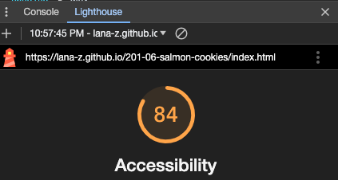

# LAB 201-class-06-07

## Salmon Cookies, last update: Tuesday

This is the salmon cookies lab, class 06, October 30, 2023.

### Author: Lana Zumbrunn

### Links and Resources

* John's demo and code review
* Paired up and with Kim for work on monday branch
* chatGPT
* Brendan's code review on Wednesday

### Lighthouse Accessibility Report Score

Wednesday - 

### Reflections and Comments
* Making some progress. In-class code review was very helpful.

* Wed: Updated table data with much help from Brendan's code review -
* Definitely need to continue to understand what is happening in the js.
* Not sure if supposed to push to Tuesday or Wednesday branch so doing both.

* Added toggle button

* Thurs: 
    - Fixed some styling issues in css
    - Added new store form
    - Still working on removing table footer row before rendering next city and getting the right new total number.